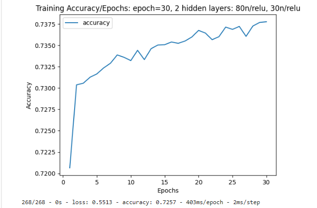
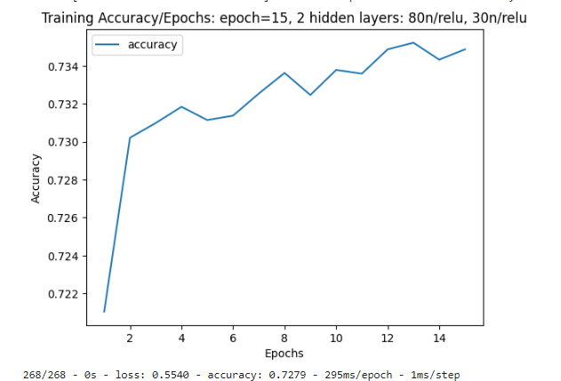
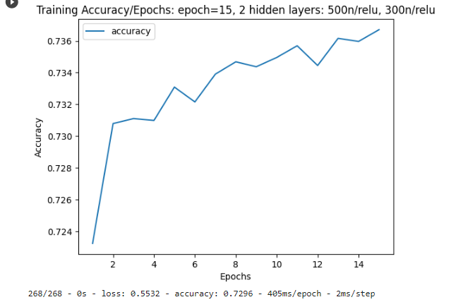
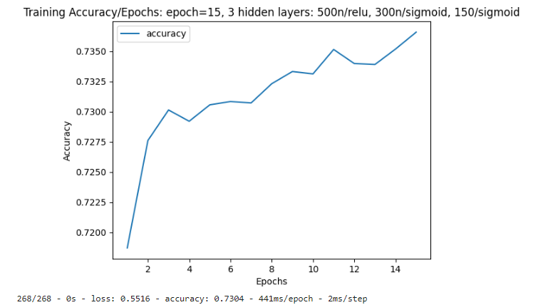
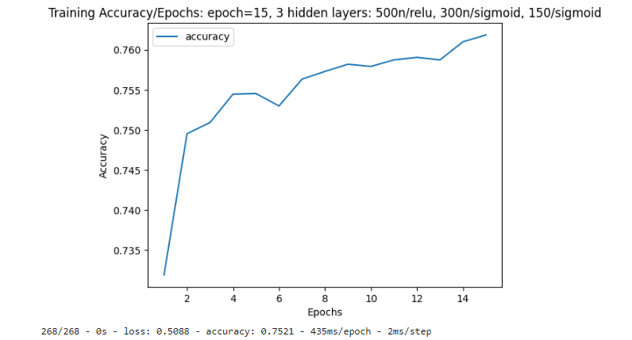

# deep-learning-challenge
In this challenge we will use machine learning and neural networks, to use features in the provided dataset to create a binary classifier that can predict whether applicants will be successful if funded by Alphabet Soup.
## What we will learn from this project:

- How to split and scale the data

- How to create a neural network 

- How to optimize the model

- How to write a report on the Neural Network Model

## Instructions:

* Split the Data into Training and Testing Sets:

* Scale the training and testing features datasets by creating a StandardScaler instance, fitting it to the training data, then using the transform function.
  
* Build a neural network model:
  
  - Specify the number of input features.
    
  - Specify the number of nodes for each layer.
    
  - Add a second hidden layer if necessary.
    
  - Specify the activation functions.
    
  - Create an output layer with an appropriate activation function.
    
* Inspect, compile, and train the model.

* Optimize the Model.

* Write  an analysis report on the Neural Network Model

  The Analysis Report contains: 
  
  - An overview of the analysis

  - The results

  - A summary
 
 ## Program:

### Tools:

- Visual Studio Code (VSCode): is a free, open-source code editor developed by Microsoft.

- Python: is a high-level programming language known for its simplicity, readability, and versatility. 

- Pandas: is a Python library for data manipulation and analysis.

- sklearn: is a Python library providing a wide range of tools for machine learning.

- tensorflow: is a Google library for machine learning and deep learning, primarily used with the Python programming language.

### Code:

#### Preprocess:

```
# Split our preprocessed data into our features and target arrays
y = application_df['IS_SUCCESSFUL']
X = application_df.drop(columns=['IS_SUCCESSFUL'])

# Split the preprocessed data into a training and testing dataset
X_train, X_test, y_train, y_test = train_test_split(X, y, random_state=48)

# Create a StandardScaler instances
scaler = StandardScaler()

# Fit the StandardScaler
X_scaler = scaler.fit(X_train)

# Scale the data
X_train_scaled = X_scaler.transform(X_train)
X_test_scaled = X_scaler.transform(X_test)

# Transform the data
X_train_scaled = scaler.transform(X_train)
X_test_scaled = scaler.transform(X_test)
```

#### Compile, Train and Evaluate the Model

```
# Create a function to Compile, train and evaluate the Model
def neural_network(X_train_scaled, y_train, X_test_scaled, y_test, hidden_nodes, epochs, activation_funcs, plot_title="Training Accuracy Over Epochs"):
    """
    Train a neural network model on the provided training data and evaluate it on the test data.

    Input:
    - X_train_scaled (numpy.ndarray): Scaled features of the training data.
    - y_train (numpy.ndarray): Labels of the training data.
    - X_test_scaled (numpy.ndarray): Scaled features of the test data.
    - y_test (numpy.ndarray): Labels of the test data.
    - hidden_nodes (list): List of integers representing the number of nodes in each hidden layer.
    - epochs (int): Number of training epochs.
    - activation_funcs (list): List of activation functions for each hidden layer.
    - plot_title (str): Title for the accuracy plot. Default is "Training Accuracy Over Epochs".

    Output:
    - nn (tensorflow.keras.models.Sequential): Trained neural network model.
    """
    # Clear TensorFlow session
    tf.keras.backend.clear_session()

    # Set seeds for reproducibility
    seed_value = 42

    # Set seed for TensorFlow
    tf.random.set_seed(seed_value)

    # Set seed for NumPy
    np.random.seed(seed_value)

    # Define the model
    number_input_features = len(X_train_scaled[0])

    nn = tf.keras.models.Sequential()

    # Add hidden layers
    for i in range(len(hidden_nodes)):
        if i == 0:
            nn.add(tf.keras.layers.Dense(units=hidden_nodes[i], input_dim=number_input_features, activation=activation_funcs[i]))
        else:
            nn.add(tf.keras.layers.Dense(units=hidden_nodes[i], activation=activation_funcs[i]))

    # Output layer
    nn.add(tf.keras.layers.Dense(units=1, activation="sigmoid"))

    # Check the structure of the model
    nn.summary()

    # Compile the model
    nn.compile(loss="binary_crossentropy", optimizer="adam", metrics=["accuracy"])

    # Create a ModelCheckpoint callback to save weights during training
    checkpoint_path = 'weights.{epoch}.hdf5'
    cp_callback = tf.keras.callbacks.ModelCheckpoint(
        filepath=checkpoint_path,
        verbose=1,
        save_weights_only=True,
        save_freq='epoch',
    )

    # Train the model
    fit_model = nn.fit(X_train_scaled, y_train, epochs=epochs, callbacks=[cp_callback])

    # Plotting the accuracy
    history_df = pd.DataFrame(fit_model.history, index=range(1, len(fit_model.history['loss']) + 1))
    history_df.plot(y='accuracy')
    plt.xlabel('Epochs')
    plt.ylabel('Accuracy')
    plt.title(plot_title)
    plt.show()

    # Evaluate the model using the test data
    model_loss, model_accuracy = nn.evaluate(X_test_scaled, y_test, verbose=2)
    print(f"Loss: {model_loss}, Accuracy: {model_accuracy}")

    # Return the trained model for further use if needed
    return nn

# Define the architecture of the neural network
hidden_nodes = [80, 30]

# Activation functions for each hidden layer
activation_funcs = ["relu", "relu"]

# Train the neural network with specified parameters
neural_network(X_train_scaled, y_train, X_test_scaled, y_test, hidden_nodes, epochs=30, activation_funcs=activation_funcs, plot_title="Training Accuracy/Epochs: epoch=30, 2 hidden layers: 80n/relu, 30n/relu")
```

## Machine Learning and Neural Network Analysis for  Funding Prediction

### Overview of the Analysis

#### Analysis Purpose:
The purpose of this analysis is to create an optimized Neural Network Model that can effectively predict if an Alphabet Soup-funded organization will be successful based on the features in the dataset.

### Data Overview:
The data used for this analysis contains information about various organizations and their applications for funding, seeking to identify the best candidates for successful ventures. The data provides variables including the application type, the Affiliated sector of industry, the Government organization classification, the Use case for funding, the Organization type, the Active status, the Income classification, the Special considerations for application and the Funding amount requested. These variables serve as independent features, and our objective is to predict the effectiveness of the funds allocated.

### Understanding the Predictive Target:
The variable to predict in this analysis is whether the funding is successful or not. It is a binary column where it takes the value 1 if the funding is successful and 0 if not.

### Machine Learning Process Stages:

  1- Preprocess:

    Step 1: Read the dataset into a Pandas DataFrame.

    Step 2: Drop unnecessary columns.

    Step 3: Bin the rare categorical variables together.

    Step 4: Encode categorical variables.

    Step 5: Create the labels set and the features set.

    Step 6: Split the data into training and testing datasets.

    Step 7: Create a StandardScaler instances, fit it to the training data, Scale the data and Transform the data.

  2- Design a neural network model:
    
    Step 1: Define the model.

    Step 2:  Summarize the model architecture.

    Step 2: Compile the model.

    Step 3: Train the model.

    Step 4: Evaluate the model using the test data to determine the loss and accuracy.

  3- Optimize the Model:

    Step 1: Adjust the input data. 

    Step 2: Design a neural network models with different configurations for optimization.

#### Data Preprocessing

- **Target Variable(s):** "IS_SUCCESSFUL" is the only target variable used to verify the effectiveness of of fund utilization.

- **Feature Variable(s):** The original feature variables used in the model include: "APPLICATION_TYPE", "AFFILIATION", "CLASSIFICATION", "USE_CASE", "ORGANIZATION", "INCOME_AMT" and "ASK_AMT". During the optimization phase, a new feature, "Name_Bins," was introduced.

- **Variables Removed:** In the optimization phase, "STATUS" and "SPECIAL_CONSIDERATIONS" were removed.

#### Compiling, Training, and Evaluating the Model

- **Neurons, Layers, and Activation Functions:** After testing various combinations, the following settings were selected based on empirical results, demonstrating the most optimized model in terms of higher accuracy:

1- Three hidden layers:

    - First hidden layer: 500 neurons using ReLU as the activation function,

    - Second hidden layer: 300 neurons using Sigmoid as the activation function,

    - Third hidden layer: 150 neurons using Sigmoid as the activation function,

2- Output layer using Sigmoid as the activation function,

3- Fifteen epochs.

While there might be other potential combinations that could yield improved results, the chosen settings represent the best-performing configuration among the tested combinations. The decision to use these specific parameters is based on empirical testing, where multiple configurations were explored to maximize accuracy.

- **Achievement of Target Model Performance:** The highest accuracy achieved with the initial settings was 73%. After incorporating changes to the input data, the predictive accuracy reached the target of 75%.

- **Steps to Increase Model Performance:** 

***Model initial:*** 

1- Two hidden layers:

- First hidden layer: 500 neurons using ReLU as the activation function,

- Second hidden layer: 300 neurons using ReLU as the activation function,

2- Output layer using Sigmoid as the activation function,

3- Thirty epochs.

 

The initial accuracy achieved was 0.7259.

***First approach: Change the settings of the model:***

1- Change the number of epochs:

After experimenting with different epoch values, starting from a higher number like 100 and gradually reducing it, the accuracy showed improvement with smaller values. This can be explained by the fact that reducing the number of epochs sometimes leads to better results, particularly when the model starts overfitting or becomes too specialized to the training data. The chosen number of epochs is 15.

 


2- Change the number of neurons in each layer:

Starting with small numbers of neurons, 50 for the first layer and 30 for the second layer, and increasing them to 500 and 300, respectively, resulted in a slight increase in accuracy.

 


3- Add a third layer:

After adding a third layer and combining different activation functions, implementing three hidden layers with the following settings resulted in an accuracy improvement to 73%.

- The first layer with 500 neurons and ReLU as the activation function,

- The second layer with 300 neurons and Sigmoid as the activation function,

- The third layer with 150 neurons and sigmoid as the activation function.

 


***Second approach: Change the data input:***

1- Creating more bins for rare occurrences in columns and increasing or decreasing the number of values for each bin:

- Initially, creating bins for the 'ASK_AMT' (funding amount requested) column was explored, but it resulted in a decrease in accuracy. This outcome highlights the significance of this column for the neural network model. Ultimately, due to the observed decrease in accuracy, the idea of using bins was abandoned, and the binned data was not incorporated into the model,

- Initially, the cutoff for the column 'APPLICATION_TYPE' (Alphabet Soup application type) was set at 500, and the column 'CLASSIFICATION' (Government organization classification) was set at 1000. After several tests, it was determined that choosing 200 as a threshold to bin the column APPLICATION_TYPE and 1000 to bin the column CLASSIFICATION seems to be reasonable values for both columns.

2- Dropping more columns:

Dropping the STATUS (Active status) and SPECIAL_CONSIDERATIONS (Special considerations for application) columns resulted in a negligible improvement in accuracy. This underscores the neutral impact of these two columns on the model.


3- Creating bins for the column 'NAME' before dropping it:

Creating bins for the 'NAME' column enables gathering insights into the distribution of name occurrences in the dataset.

The addition of this new column has a significantly positive impact, playing a crucial role in reaching our goal of 75% accuracy.



While 'NAME' is not a key column, allowing for the possibility of multiple organizations sharing the same name, this redundancy doesn't pose a hindrance. In fact, the presence of similar names may reveal meaningful trends or patterns, indicating commonalities in type, classification, or affiliation among organizations. The similarity in names could provide valuable insights, contributing to the model's predictive capabilities.

#### Note on Model Training Variability:

It's important to note that the reported accuracy numbers can exhibit slight variations in different runs, even with a fixed random seed. The training process of neural networks involves certain random elements, such as weight initialization and dropout, which contribute to this variability. Despite these small fluctuations, the general trends and improvements observed in the model's performance across different configurations remain consistent.

### Summary

#### Neural Network Performance:
The deep learning model, implemented as a neural network, demonstrated notable success with an accuracy of 75%. This accomplishment underscores its proficiency in capturing intricate patterns within the data, which is pivotal for predicting funding outcomes.

#### Exploring Alternatives: Random Forest Analysis:

While the neural network excelled, an exploration of alternative models led to the evaluation of a Random Forest classifier. Despite a slightly lower accuracy of 73%, the Random Forest model offers distinct advantages. In contrast, Linear Regression, which was also considered, did not provide meaningful insights or contribute significantly to a comprehensive understanding of the dataset.

#### Advantages of Random Forest:

The Random Forest model excels in scenarios where interpretability is crucial. Its robustness, lower susceptibility to overfitting, and insights into feature importance make it an appealing choice for specific applications, offering a more comprehensive set of metrics for a nuanced evaluation of model performance.

#### Choosing Between Accuracy and Interpretability:

The choice between the neural network and the Random Forest hinges on the classification problem's specific requirements. If the primary goal is maximizing accuracy, the neural network is favored. However, if interpretability is a priority and a slight reduction in accuracy is acceptable, the Random Forest model provides valuable insights.


